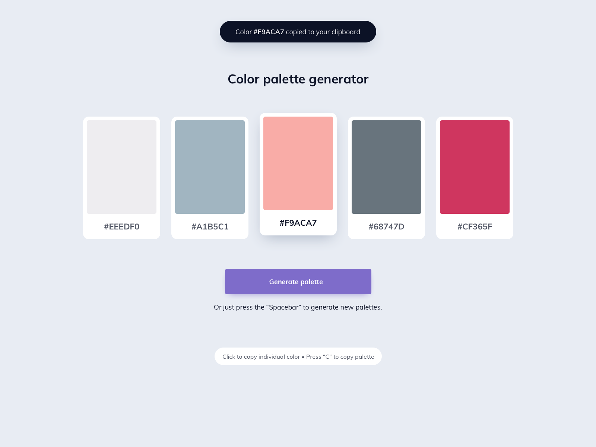

## Preview

# Color Palette Generator

Welcome to the Color Palette Generator repository! This web application allows users to generate beautiful color palettes for their projects.

## Description

The Color Palette Generator provides a simple and intuitive interface for creating stunning color combinations. With random color generation and easy copy-to-clipboard functionality, it's a handy tool for designers and developers.

## Features

- Random color palette generation
- Click-to-copy individual color codes
- Palette copy with a keyboard shortcut (Press "c")

## Getting Started

To use the Color Palette Generator,  just click here https://palettifyy.netlify.app/

## Usage

1. Click on individual color squares to copy the color code.
2. Press the "Spacebar" to generate a new random color palette.
3. Press "c" to copy the entire palette.

## Contributing

Contributions are welcome! If you have ideas for improvements or new features, feel free to fork the repository and submit a pull request.

## License

This project is licensed under the [MIT License](LICENSE).

---

Happy color palette generating!
